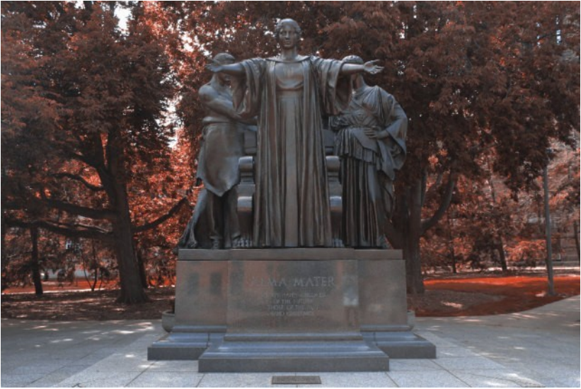
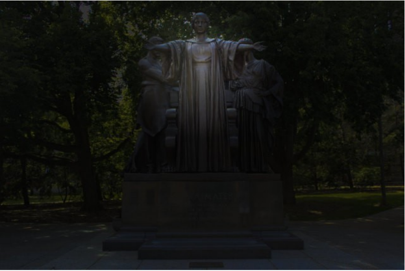
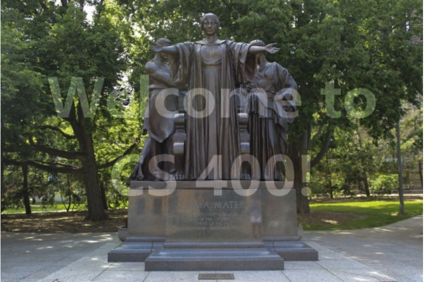

# ImageTransformation
Image Transformation in "illinify", "spotlight" and "watermark" by using C++

# About Project
This is the final task from the coursera short course "Object-Oriented Data Structures in C++". 
This project will run on any C++ Compailer or IDE. 
ImageTransform.cpp is contains the followwing functions:
- illinify
- spotlight
- watermark

# Results
1. illinify  

 

2. spotlight  

 

3. watermark  

